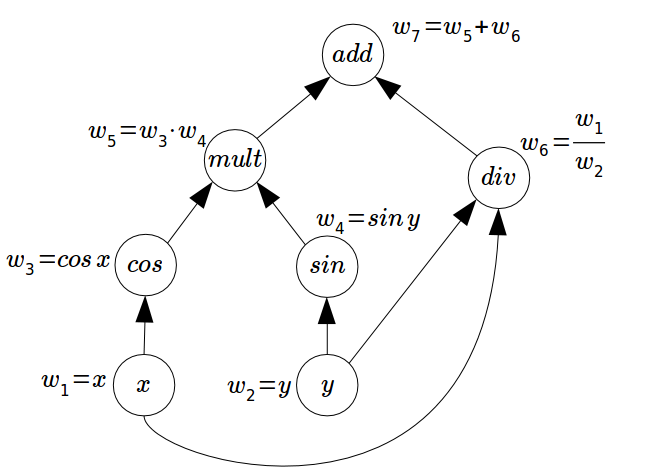

# Introduction

Since Newton invented calculus, differentiating a function has been essential to the advancement of humanity. Calculating the derivative of a function is crucial to finding the extrema for a function and determining zeros for a function, two operations that are central to optimization. Often, we can find the symbolic/analytical solution to the derivative of a function, however this has become increasingly complex and computationally expensive as our functions/equations have grown in size and complexity. Numerically solving differential equations forms a cornerstone of modern science and engineering and is intimately linked with machine learning; however this method suffers from rounding errors and numerical instability. Many of these issues can be solved using Automatic Differentiation (AD) because AD can calculate the exact derivative up to machine precision. The logic and processes behind AD enables it to be implemented using computer code, making it easily accessible for use by scientists and mathematicians. This python package will implement the forward mode of AD.

# Background

The mathematical background and concepts that may fit in are:

- Differential calculus

Differential calculus is a subfield of calculus concerned with the study of the rates at which quantities change.
Given the function: 
\begin{align}
 f\left(x\right) &=  {x^{2}}     
 \end{align}
 
 Increment x by h:
 \begin{align}
 f\left(x+h\right) &=  {(x+h)^{2}}     
 \end{align}
 
 Apply slope formula:
  \begin{align}
 \frac{f\left(x+h\right) - f\left(x\right) }{h}
 \end{align}
 
Simplyfy equation:
  \begin{align}
 \frac{x^{2}+2xh+h^{2}-x^{2} }{h}
 \end{align}
   \begin{align}
 \frac{2xh+h^{2}}{h} &=2x+h
 \end{align}
 
 Set h to 0:
   \begin{align}
 2x +0 &= 2x
  \end{align}
  
The formula defined is:
\begin{align}
 \lim_{h\to0} \frac{f\left(x+h\right) - f\left(x\right) }{h}
 \end{align}
 
- The chain rule

For a function $h(u(t))$, the derivative of $h$ with respect to $t$ can be expressed as:
$$\dfrac{\partial h}{\partial t} = \dfrac{\partial h}{\partial u}\dfrac{\partial u}{\partial t}.$$
If the function is expressed as a combination of multiple variables that are expressed in terms of t, i.e. $h(u(t), v(t))$, the the derivative of $h$ with respect to $t$ can be expressed as:
$$\frac{\partial h}{\partial t} = \frac{\partial h}{\partial u}\frac{\partial u}{\partial t} + \frac{\partial h}{\partial v}\frac{\partial v}{\partial t}$$
Note that we are only looking at scalar variables in this case, but this idea can be extended to vector variables as well.

- The graph structure of calculations and forward accumulation

Forward accumulation is computing the derivative using the chain rule starting from the inner most derivative to the outer most derivative, where we assume the most basic variables have seed values. Using a graph helps visualize forward accumulation. For example,

\begin{align}
 f\left(x,y\right) &= \frac{x}{y} +cos(x)sin(y)\\
\end{align}
 


- Elementary functions and their derivatives

|       Function $f(x)$                |       Derivative $f^{\prime}(x)$                |
| :-------------------:  | :------------------------------------------------------------------------------:  |
| ${c}$           | $0$         |
| ${x}$           | $1$         |
| ${x^{n}}$           | ${nx^{n-1}}$         |
| $\frac{1}{x}$     | $\frac{-1}{x^{2}}$     |
| $ln{x}$     | $\frac{1}{x}$     |
| $\sin(x)$           |   $\cos(x)$         |
| $\cos(x)$           |   $-\sin(x)$         |
| $\tan(x)$           |   $\dfrac{1}{\cos^2(x)}$         |
| $\exp(x)$           |   $\exp(x)$         |
| ${a^{x}}$           |   ${a^{x}\ln{a}}$         |


# How to Use *autodiff*


Ideally, a user should not be overwhelmed by our package. They would only need to import our package and instantiate the basic variables or vectors (i.e. $x_1, x_2, x_3,  \vec{x}$, etc.). Using the AD objects, the users will be able to easily call operations such as addition, subtraction, sine, exponential, etc. with both other AD objects and also normal numbers (*int* and *float*), forming the expressions that they want. The AD objects will feel perfectly integrated, and the users can get the value/derivatives of the expressions with basic get calls. 

For example, in the case of scalar functions/values, the user will type something like this:

```python

import autodiff as ad

x = ad.Scalar('x', 2)
x.get_value()
>>>2
x.get_deriv()
>>>{'x': 1}
y = ad.Scalar('y', 5)
y.get_value()
>>>5
y.get_deriv()
>>>{'y': 1}
z  = x + y
z.get_value() 
>>> 7
z.get_deriv()
>>> {'x': 1, 'y': 1}
z2 = x*y  
z2.get_value()
>>>10
z2.get_deriv()
>>> {'x': 5 , 'y': 2 }
z3 = y ** 2 
z3.get_value() 
>>> 25
z3.get_deriv()
>>>{'y': 10}
z4 = ad.sin(ad.Scalar('x1',  0))
z4.get_value()
>>> 0
z4.get_deriv()
>>> {'x1': 1}
```

This idea can be extended to the cases of vectors.
```python
#do not need to follow this naming convention
x1 = ad.Scalar('x1', 10) 
x2 = ad.Scalar('x2', 4)
x = ad.Vector([x1, x2, x1 + x2, x1 * x2])
x.get_values()
>>> np.array([10, 4, 14, 40])
#There can be a function to return it as matrix
x.get_derivs()
>>> [{'x1': 1, 'x2': 0}, {'x1': 0, 'x2': 1}, {'x1': 1, 'x2': 1}, {'x1': 4, 'x2': 10}]
```


# Software Organization
       
 * The directory structure would look like that:      
 ```
 autodiff\
          autodiff\
                    __init__.py
                    variables.py (scalar and vector)
                    functions.py
                    test\
                         __init__.py
                         test_variables.py
                         test_functions.py
          README.md
          setup.py
          LICENSE
               
 ```            

The plans on organizing our software package are: 

* We are planning to use *numpy* to conduct most of our calculations, vector operations and definition of elementary functions.
* The test suite will live in the test directory shown above. We are using both `TravisCI` and `Coveralls`
* We want to release our package on `PyPI`


# Implementation

Our core data structure for implementing the forward mode of automatic differentiation will be based on the *Scalar* and *Vector* classes. ** To initialize a *Scalar* class, the user will pass in a string that represents the variable (i.e. 'x', 'y', 'x1', etc.) and also the value of variable (the seed value).** The *Scalar* class will hold two attributes: 1) the value of the variable `val` at the current step and 2) a dictionary `deriv` containing the derivative or partial derivatives (keys will be the names of the variables (i.e *x* and *y*) and the values will be the derivative value with respect to each variable). **This allows us to easily compute derivatives with respect to a variable when we are performing operations with multiple variables since then we can update each partial derivative individually based on the variable. When a *Scalar* object is initialized, by default `deriv` will just be a dictionary with the only key being the string the user passes in with value 1.** A user can access the value of a *Scalar* object using the *get_value()* method and access the derivative (or partial derivatives) for the object through the *get_derivs()* method. The dunder methods __add__, __sub__, __mul__,  __truediv__, __pow__, __iadd__, __isub__, __imul__, __itruediv__, __ipow__ (and the right equivalents for the ones that have one) will all be overwritten so that they return a new *Scalar* object with an updated value and derivatives. **In these methods, the object will be initialized with a `None` object as the variable to avoid overwritting a variable from the original object and the other object if the other argument is another *Scalar* class object. Then, we can easily remove the `None` key-value pair from the `deriv` dictionary and update the keys based on the variables in the original object (+ the other object) and the rules of differentiaton. By overwriting these methods, we are implementing forward accumulation, as the orders of operation allows us to traverse the chainrule starting from the inside.**

Another class called *Vector* will take in a list or array of *Scalar* objects. A *Vector* only has one attribute: a numpy array of *Scalar* objects, since each *Scalar* object will track its current value and derivative. The dunder methods __add__, __sub__, __mul__,  __truediv__, __pow__, __iadd__, __isub__, __imul__, __idiv__, __ipow__ (and the right equivalents) will all be overwritten so that they return a new array of *Scalar* objects with updates values and derivatives.  **Similar to numpy methods, the operations are conducted element-wise, i.e. In an addition operation between two *Vector* objects, the first row is added to the first row, second row is added to the second row, etc. As a result, one vector operation becomes multiple scalar operations.** To access the values in the *Vector* object, the user can use the *get_values()* method, which returns a *numpy.array* of values. To access the derivatives in the *Vector* object, the user can use the *get_derivs()* method, which returns a list of dictionaries containing derivatives or partial derivatives for each *Scalar* object in the array. **We can also add a function that returns this as a matrix, which is the Hessian. We can also add an optional argument to *get_derivs()* such that the user can just get the derivatives or partial derivatives with respect to the desired variables only (i.e. with respect to x, with respect to y, etc.). The user can obtain a copy of the *numpy.array* with *Scalar* objects using the *get_vector()* method, which will return a copy of the *numpy.array* to the user.**

We will implement functions *sin, cos, tan, arcsin, arccos, arctan, exp* (e^x), *power* (a^x), and *abs* (absolute value). The functions will not be implemented in a specific class, similar to the implementation of *numpy* . These functions will be written such that if a *Scalar* object is passed in, then a new *Scalar* object with an updated value and derivative is returned, depending on the function being called. If a *Vector* object is passed in, then a new *Vector* object with updated values and derivatives is returned. If one of the functions is not differentiable at a given value, then we will throw an error for the user and explain that the function is not differentiable at this specific value.

The implementation of our classes and functions will rely heavily on *numpy*.

